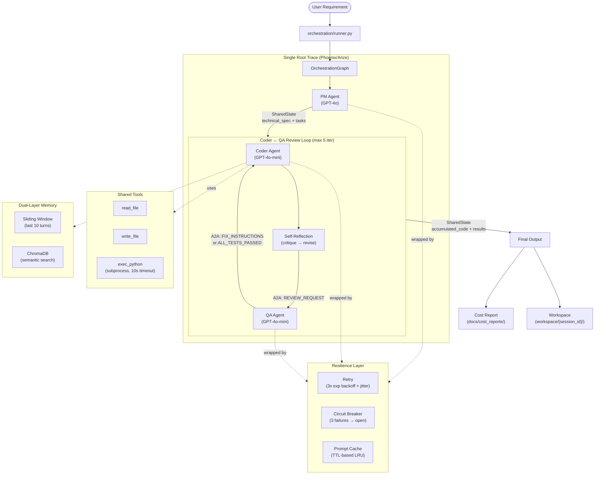

# Architecture Documentation

## System Overview

The Multi-Agent Dev Team is a three-agent AI system that collaborates to
transform natural-language software requirements into tested, production-quality
Python code. A **Product Manager** agent decomposes requirements into structured
technical specifications, a **Coder** agent implements each task using a ReACT
reasoning loop with self-reflection, and a **QA & Debugger** agent writes and
executes real pytest tests, feeding fix instructions back to the Coder through
an iterative review loop. All three agents operate within a single orchestration
graph, share state through a typed Pydantic model, and communicate via the A2A
(Agent-to-Agent) protocol with correlation-tracked messages. The system is
instrumented with distributed tracing, per-agent cost tracking, retry logic
with circuit breakers, and is deployable via Docker Compose.

---

## Data-Flow Diagram

---

## Agent Descriptions

### Product Manager Agent (`agents/pm_agent.py`)

| Attribute | Value |
|-----------|-------|
| **Model** | GPT-4o (larger model for complex reasoning) |
| **Role** | Translate requirements → technical spec + task list |
| **Max Tasks** | 8 (consolidates if more are identified) |

**Decision Logic:**
1. Receives the raw user requirement from SharedState.
2. Generates a structured JSON output containing a `TechnicalSpec` and a list
   of `TaskItem` objects.
3. Validates the output against Pydantic schemas before writing to SharedState.
4. If more than 8 tasks are generated, consolidates the lowest-priority ones
   into a single combined task.
5. Sets `state.phase = "pm_complete"` to signal the Coder.

### Coder Agent (`agents/coder_agent.py`)

| Attribute | Value |
|-----------|-------|
| **Model** | GPT-4o-mini (faster, cheaper for code generation) |
| **Role** | Implement each task using ReACT loop + tools |
| **Max Iterations** | 10 per task (ReACT loop) |

**Decision Logic:**
1. Reads pending tasks from SharedState (handoff protocol: `status == PENDING`).
2. For each task:
   a. Retrieves relevant context from dual-layer memory.
   b. Executes a ReACT loop: Thought → Action (tool call) → Observation → Repeat.
   c. Runs **self-reflection**: critiques its own code for bugs and edge cases,
      then produces a revised version.
   d. Writes the final code to the session workspace.
3. Sends the code to QA via A2A `REVIEW_REQUEST` message.
4. If QA returns `FIX_INSTRUCTIONS`, revises the code and resubmits.
5. Updates task status and accumulated code in SharedState.

### QA & Debugger Agent (`agents/qa_agent.py`)

| Attribute | Value |
|-----------|-------|
| **Model** | GPT-4o-mini (fast test generation) |
| **Role** | Write pytest tests, execute them, produce fix instructions |
| **Test Execution** | Sandboxed subprocess with configurable timeout |

**Decision Logic:**
1. Receives code via A2A `REVIEW_REQUEST` message.
2. Generates pytest tests based on the task's acceptance criteria.
3. Writes tests to the workspace and executes them via `subprocess.run()`.
4. Parses pytest output to count passed/failed tests.
5. If all pass → sends `ALL_TESTS_PASSED` via A2A.
6. If failures → generates structured `FixInstruction` objects → sends
   `FIX_INSTRUCTIONS` via A2A.
7. If max iterations reached → produces a `FinalQAReport` listing unresolved
   issues (convergence safeguard).

---

## Orchestration Framework

### Why CrewAI?

We chose **CrewAI** as the orchestration framework for these reasons:

1. **Native Azure OpenAI support** — CrewAI has built-in Azure AI Inference
   integration, avoiding the need for custom LLM adapters.

2. **Agent-tool binding** — CrewAI's `@tool` decorator and agent `tools=[]`
   parameter make it trivial to give agents access to file I/O and code
   execution without manual function-calling plumbing.

3. **Built-in ReACT loop** — CrewAI agents natively follow a Thought → Action
   → Observation cycle with configurable `max_iter`, which maps directly to
   our Phase 1 requirement.

4. **Lightweight** — Unlike AutoGen (which requires conversation protocols)
   or LangGraph (which requires explicit state graph definitions), CrewAI
   lets us define agents declaratively and compose them into simple crews.

5. **Extensibility** — We wrapped CrewAI's `crew.kickoff()` with our own
   resilience layer (retry + circuit breaker) and tracing, giving us
   production-grade reliability without modifying the framework.

### What We Built On Top

CrewAI handles individual agent execution. We built the following on top:

| Component | Purpose |
|-----------|---------|
| `OrchestrationGraph` | Sequential pipeline of named nodes sharing `SharedState` |
| `ReviewLoop` | Iterative Coder↔QA cycle with A2A messaging |
| `A2AMessageBus` | In-process message routing with correlation tracking |
| `SharedState` | Typed Pydantic model — single source of truth |
| `CostTracker` | Per-agent token and cost recording |
| `CircuitBreaker` | Fault isolation per service |
| `Phoenix Tracing` | Single root span with child spans per agent |

---

## Key Design Patterns

### 1. Shared State (not message passing)
All agents read from and write to a single `SharedState` Pydantic model.
This avoids the complexity of distributed message queues while ensuring
type safety and JSON serializability.

### 2. A2A for Coder, QA (peer communication)
The Coder and QA agents communicate via typed A2A messages with correlation
IDs. This was chosen over MCP because the agents are peers exchanging work
products, not a client calling a tool server.

### 3. Session Isolation
Every pipeline run creates a unique `workspace/{session_id}/` directory.
All generated code, test files, and execution artifacts are scoped to this
directory, enabling parallel runs and clean test isolation.

### 4. Graceful Degradation
- Circuit breaker returns cached results when open.
- Memory system falls back to sliding window if ChromaDB is unavailable.
- QA produces a final report instead of looping forever.
- All errors are captured in SharedState - the pipeline never crashes.
